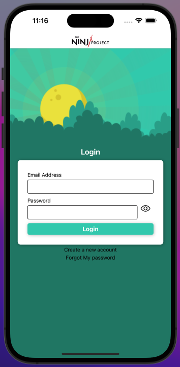

# React Native Authentication Workshop

The aim of this repository is to gather, with educational purposes, the step by step implementation
for a complete authentication workflow in a React Native App.

## Project Current State

The status of the project at this moment presents the user interface developed with 4 different screens: Login, Register, Confirm_registration and Reset_password. The logic behind and the auth backend connection are a work in progress.

## App preview



## How to use it

There are two alternatives.

### npm & Expo

This project uses Expo to develop React Native applications for Android and IOS, check its [installation] guidelines to use it with your computer. Once everything is prepared you can just type the following commands on the project's root folder:

```bash
npm install
npm start
```

And scan the QR code using the [Expo Go] app with your phone, it will build the app and start it on your phone for testing. You could also use an Android or IOS simulator with your computer, please check the Expo documentation to find out how to do it.

### Docker

If you don't want to install everything on your machine, and you are familiar with Docker, you can just use the [Dockerfile] that it is provided in the project to build a development docker image and launch it running:

```bash
    ./scripts/init-development-container.sh
```

This script will launch the Expo project in a Docker container and if you are in the same wifi net you can use the [Expo Go] app with your phone. But you won't be able to use Android or IOS simulators.

[installation]: https://docs.expo.dev/get-started/installation/
[Dockerfile]: ./Dockerfile
[Expo Go]: https://docs.expo.dev/get-started/installation/#expo-go-app-for-android-and-ios

## Authentication backend

### Install and configure Amplify

We need to create and enable an amplify user and profile our local machine to be able to provision cloud resources.

```bash
    npm install -g @aws-amplify/cli
    amplify configure
```

For more details follow the [initialization docs].

[initialization docs]: https://docs.amplify.aws/lib/project-setup/prereq/q/platform/react-native/#option-2-follow-the-instructions

### Initialize amplify project

Now we will initialize the amplify project in our repository. Remember to select AWS profile as the authentication method to create cloud resources, and select the previously created.

```bash
    amplify init
```

### Environment management

It is also recommendable to understand the environment management.

```bash
    amplify env list
    amplify env add
    amplify env checkout
    amplify env remove
```

## Authentication

Run the following command selexcting "Default configuration". We will select "Email" as authentication method. Additional changes enables us to selct more attibutes required to sign-up, but we can modify this later.

```bash
    amplify add auth
```

now we will publish changes to the cloud. This can take a few minutes.

```bash
    amplify push
```

Now we will have a fully functional cognito user-pool & identity-pool backend for our app.

### Connect app to authentication server

After the backend authentication is ready, we can start writting the code to connect our app to it. but first we will need to install the following libraries:

```bash
npm install aws-amplify amazon-cognito-identity-js @react-native-community/netinfo @react-native-async-storage/async-storage
```

## Images property

Images listed below are property of ***[The Ninja Project]*** & ***BBVA 2023***, they kindly allowed its use for this Wokshop to be possible:

* [ninjaLogo]
* [ninjaBackground]

[The Ninja Project]: https://www.theninjaproject.bbva/
[ninjaLogo]: assets/ninjaLogo.png
[ninjaBackground]: assets/ninjaBackground.png